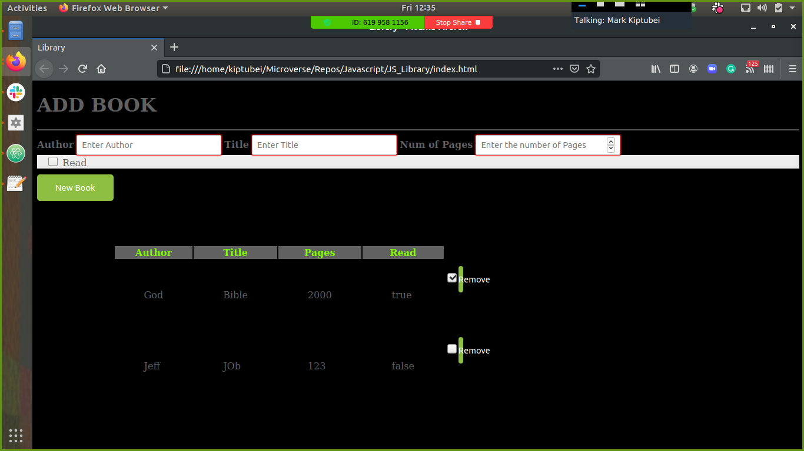

# JS_Library

Small library that display the book that I have read or intend to read soon

# Project Specification

1. Create and store books in a Book object
2. Displays each book on the page, displays them in a table
3. “NEW BOOK” button that brings up a form allowing users to input the details for the new book: author, title, number of pages, whether it’s been read and anything else you might want.
4. Button on each book’s display to remove the book from the library.
5. Button on each book’s display to change its read status.
6. Used localstorage to store book data

## Built With

- HTML5
- CSS
- Javascript ES6

## screenshots

### Index Page

## Getting Started

To get a local copy up and running follow these steps:

### Prerequisites

Mozilla Firefox

- Javascript enabled

### Usage

- Fork/Clone this project to your local machine
- Open folder in your local enviroment and run these lines of code to get started:
- Double click on index.html
- To view in IDE just open project folder in your prefered IDE

## Authors

👤 **Mark James Kiptubei**

- Github: [@kiptubei](https://github.com/kiptubei)
- Twitter: [@mjabei](https://twitter.com/mjabei)
- Linkedin: [Mark James Kiptubei](https://www.linkedin.com/in/mark-james-k-aa875829/)

👤 **Tendongze Godson**

- Github: [tGodson](https://github.com/tGodson)
- Twitter: [@tendongze95](https://twitter.com/tendongze95)
- Linkedin: [linkedin](https://www.linkedin.com/in/tendongzegodson)

## 🤝 Contributing

Contributions and feature requests are welcome!

Start by:

- Forking the project
- Cloning the project to your local machine
- `cd` into the project directory
- Run `git checkout -b your-branch-name`
- Make your contributions
- Push your branch up to your forked repository
- Open a Pull Request with a detailed description to the development(or master if not available) branch of the original project for a review

## Show your support

Give a ⭐️ if you like this project!

## Acknowledgments
